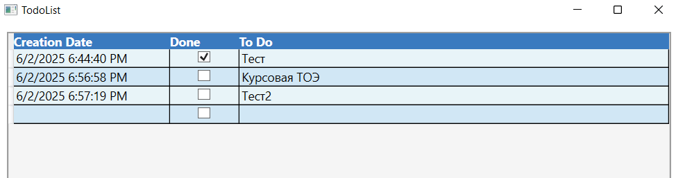

# TodoList

## Описание
TodoList - простое приложение для управления задачами, которое позволяет добавлять, изменять и удалять задачи. Задачи сохраняются в файл JSON, что позволяет сохранять их между сеансами работы приложения.

## Структура проекта
   Файл | Описание |
 |---|---|
 | FileIO.cs | Класс для работы с файлами, отвечает за загрузку и сохранение данных. |
 | TodoModel.cs | Модель задачи, включает свойства задачи и уведомления об их изменении. |
 | MainWindow.xaml.cs | Основное окно приложения, отвечает за взаимодействие с пользователем и управление задачами. |

## Компоненты

### FileIO.cs
Класс `FileIO` отвечает за загрузку и сохранение данных в файл JSON.
 | Метод | Описание |
 |---|---|
 | `LoadData()` | Загружает данные из файла. Если файл не существует, создает новый файл. |
 | `SaveData(object todoDataList)` | Сохраняет данные в файл. |

### TodoModel.cs
Класс `TodoModel` представляет собой модель задачи и реализует интерфейс `INotifyPropertyChanged` для уведомления об изменении свойств.
 | Свойство | Описание |
 |---|---|
 | `CreationDate` | Дата и время создания задачи. |
 | `IsDone` | Флаг выполнения задачи. |
 | `Text` | Текст задачи. |

 | Событие | Описание |
 |---|---|
 | `PropertyChanged` | Событие, которое вызывается при изменении свойств задачи. |

### MainWindow.xaml.cs
Класс `MainWindow` представляет собой основное окно приложения и отвечает за взаимодействие с пользователем.
 | Метод | Описание |
 |---|---|
 | `Window_Loaded` | Обработчик события загрузки окна, загружает данные из файла и привязывает их к DataGrid. |
 | `_todoDataList_ListChanged` | Обработчик изменения списка задач, сохраняет изменения в файл. |

## Пример использования

